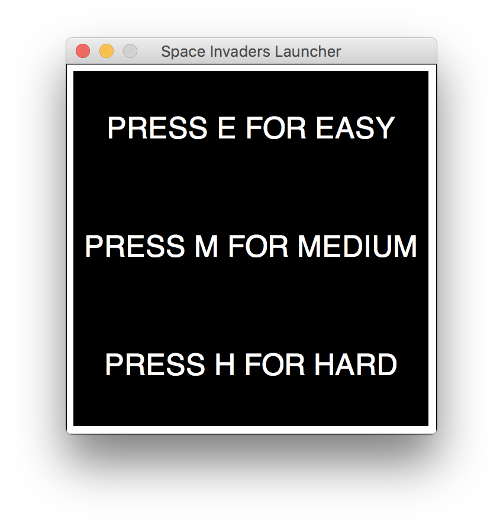
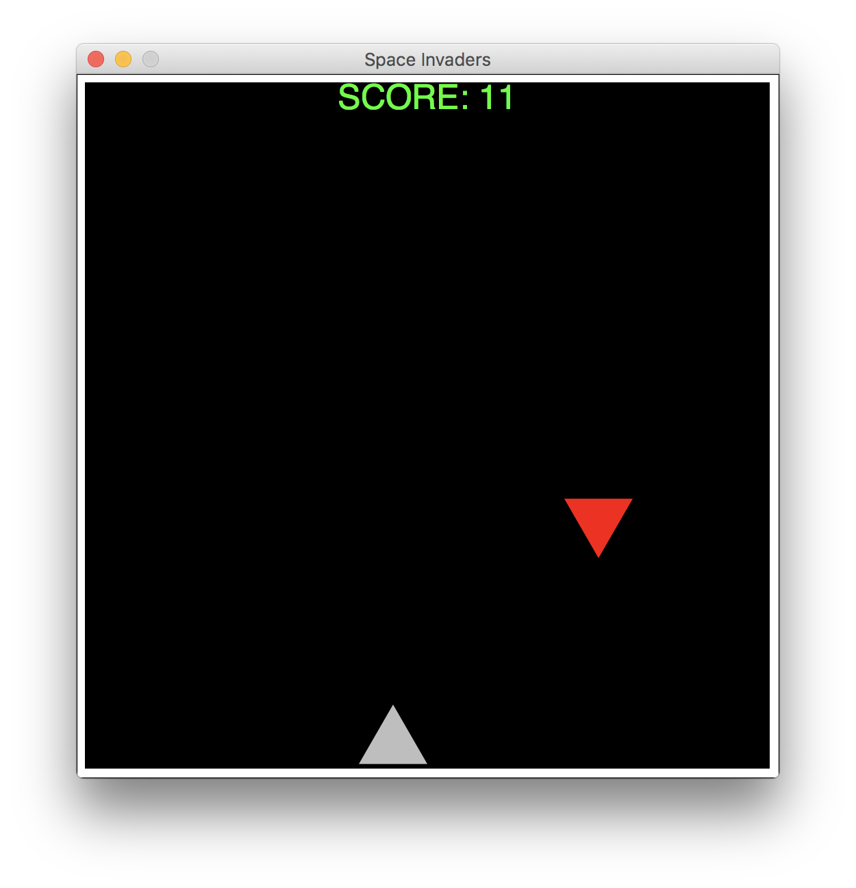

# racket-space-invaders
A small, basic space invaders clone built using the Racket language.

## Screenshots

    
    

## Installation:

1. Download and install [DrRacket](https://racket-lang.org/)
2. Clone this repository: `git clone https://github.com/msafadieh/racket-space-invaders.git` 
3. Open `space-invaders.rkt` with DrRacket
4. Click "Run" in the top right of the screen
